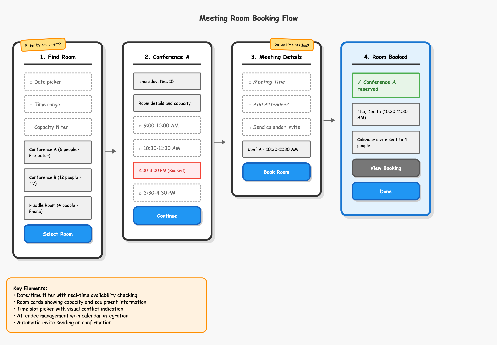

# Breadboarding Kit

A rapid prototyping system for UX flows that visualizes interactions with key elements in 15-20 seconds using any LLM. Based on Basecamp's [breadboarding](https://basecamp.com/shapeup/1.3-chapter-04#breadboarding) method from Shape Up.



## What This Is

**Breadboarding Kit** helps you quickly create UX flow sketches for live collaboration sessions. You can start by describing what you want, and any LLM will generate visual HTML wireframes that look intentionally rough - keeping focus on structure and flow rather than visual details. You can view them in your browser or copy them to a digital whiteboard like Figma or Lucid for further collaboration.

## Why Use This

- **Speed**: Generate flow sketches in 15-20 seconds vs. traditional tools (2-5 minutes)
- **Flexible start**: Begin with any description, no special format required
- **Fast iteration**: Edit outlines directly for rapid changes during sessions
- **Focus**: Intentionally rough aesthetic prevents premature detail fixation
- **Collaboration**: Perfect for live ideation and client workshops  
- **Handoff**: Structured components make designer handoff clear

## How It Works

### **Two Ways to Work**

**Option A: Start with Any Description (Easiest to Start)**
```
"Create a flow for users to book meeting rooms"
"Design a checkout process for an e-commerce site"  
"Show how users would reset their password"
```

**Option B: Use Structured Outline (Fastest for Iteration)**
```markdown
## Screen 1: Login
- input: □ Email address
- input: □ Password  
- button: Sign In [primary]
```

### **Iteration Options**

**Keep Chatting** (easier, but slower)
- "Add a forgot password link"
- "Make the confirmation screen blue"

**Edit Outline + Regenerate** (faster once you learn it)
- Modify the generated outline directly
- Say "regenerate HTML from this outline"
- Perfect for rapid changes during live sessions

## Quick Start

### 1. Set Up Your LLM
Copy the contents of `system-prompt.md` and provide it as context to your LLM along with the CSS kit (`breadboarding-kit.css`). (You may find it helps to include the demo files as context also.)

### 2A. Start with Description (Recommended)
Simply describe what you want:

```
"Create a user flow for booking meeting rooms. Users should be able to:
- Select date and time
- Choose from available rooms
- Add meeting details
- Get confirmation"
```

The LLM will generate both an outline and HTML implementation.

### 2B. Or Use Structured Outline (For Speed)
If you prefer to start with structure, use this format:

```markdown
# Flow Name - OUTLINE

## Flow Goal
[One sentence describing the end state/success outcome]

## Screen 1: [Screen Name]
- input: □ [Description of input field]
- display: [Information shown to user]
- button: [Action Text] [primary/secondary]
- note: [Question or annotation]
```

### 3. Iterate Efficiently
**For quick changes during sessions:**
- Edit the generated outline directly
- Tell your LLM: **"Generate HTML implementation from this updated outline"**
- Much faster than chatting back and forth

**For complex changes:**
- Keep chatting with the LLM about what you want to change
- Let it handle the outline and HTML updates

## Element Types Reference

When editing outlines directly, use this syntax:

### Required Elements
- `input: □ [description]` - User interaction areas (dashed borders)
- `display: [text]` - Information shown to user (solid borders)
- `button: [text]` - Action buttons (rounded with shadows)
- `confirm: ✓ [text]` - Success/confirmation messages (green)
- `note: [text]` - Sticky note annotations (yellow)

### Modifiers
- `[primary]` - Blue primary button
- `[secondary]` - Gray secondary button
- `[unavailable]` - Red background for blocked items
- `[text field]` - Text input styling
- `[email inputs]` - Email input styling
- `[right]` - Right-side sticky note
- `[email-screen]` - Blue screen background for notifications

## Visual Design Philosophy

### Shape Language
- **Square elements** = Content/Information (display, input, confirm)
- **Rounded elements** = Actions (buttons with shadows)

### Color Usage
- **Blue** = Primary actions
- **Gray** = Secondary actions
- **Green** = Success states only
- **Red** = Errors/warnings only
- **Yellow** = Annotations only

### Layout
- **Left-aligned content** for better scanning
- **Consistent element heights** for grid-like organization
- **Thick borders** prevent fine detail focus
- **Comic Sans font** signals "conceptual phase"

## Workflow Tips

### Starting Sessions
- **Begin conversationally** - describe what you want in natural language
- **Review generated outline** - make sure the flow logic makes sense
- **Iterate on structure** before worrying about visual details

### Live Collaboration
- **Project the HTML** for everyone to see
- **Edit outline in real-time** as feedback comes in
- **Regenerate instantly** - keep momentum during discussions
- **Use sticky notes** (`note:`) for capturing questions and concerns

### Speed Optimization
- **Learn the element syntax** for faster direct editing
- **Keep outlines simple** - focus on interaction patterns, not copy
- **Use consistent naming** for screen titles and actions
- **Don't edit HTML directly** - always go back to outline

## Example Use Cases

- Live UX strategy sessions with stakeholders
- Client workshops for flow ideation and validation
- Early-stage product planning and team alignment
- Rapid iteration on user journeys during design sprints
- Designer handoffs with clear interaction specifications
- User research prep - create flows to test with users

## Files Included

- **`breadboarding-kit.css`** - Complete CSS framework
- **`demo-outline.md`** - Example outline (meeting room booking)
- **`demo-implementation.html`** - Generated HTML from demo outline
- **`system-prompt.md`** - LLM context for consistent generation

## Getting Started

### Method 1: Start with Description
1. Copy `system-prompt.md` and `breadboarding-kit.css` content to your LLM
2. Describe your desired user flow in natural language
3. Review the generated outline and HTML
4. Iterate by editing the outline or continuing the conversation

### Method 2: Start with Outline
1. Copy `system-prompt.md` content to your LLM  
2. Review `demo-outline.md` to understand the format
3. Create your outline using the required syntax
4. Generate HTML and iterate

**Either way works!** Choose what feels more natural for your workflow.

---

**Inspired by**: Basecamp's breadboarding methodology from [Shape Up](https://basecamp.com/shapeup)  
**Philosophy**: Use intentionally constraining tools to focus on structure over details  
**Best for**: Live collaboration, rapid iteration, and maintaining design momentum